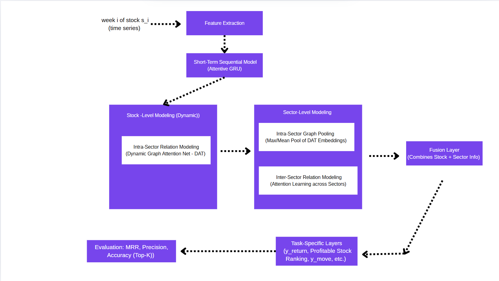

In modelstruct.ipynb ,you can check what is store inside the  'best_model_dim32.pt' like complete architecture of the model,weights 
stored during the training time .

FINDAT -
How to run this directory to get the FINDAT model-

Step 1-Run data_collection .py 
    Input for this is ind_nifty500list_filtered_final-1.csv file
    Output: The data of past year stored in data/cleaned directory (start date and end date - 10-1-22 to 10-1-25)

Step 2: Run preprocess.py 
      In this we add the additional features ,apply sliding window ,and split the each stock data into train,val,test
      Input:data/cleaned
      Output:We get adj_matrix.npy,sector_mapping.csv, data/processed and data/windows   directory .

Step3: Run train.py 
     In this , train the model
     I run this model for GRU dim=[8,16,32,64] and I got the best model for [32] gru dim

After training we the best model saved in .pt format in the checkpoints directory .

For New data from 11-1-25 to 10-4-25

In the 'DataFromJanToApril' directory we have the new data from 11-1-25 to 10-4-25

Step4- Run the AblationCode.py file
 After running we get the instance metric and daily predicated ranks for each day in each csv files

       
      
    
